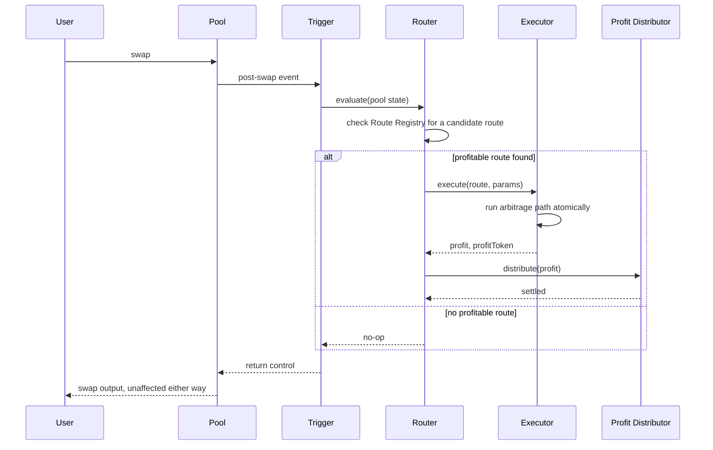
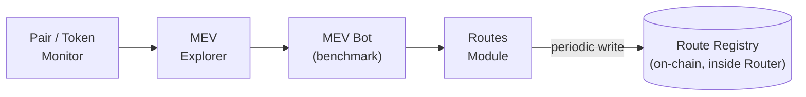

## System Properties

Homelander operates as an adjunct execution pipeline, isolated from core AMM mechanics. When no profitable opportunity exists, the pipeline stays inactive and adds no cost to the swap.

- **Atomicity** — backrun execution and settlement happen inside the same transaction as the swap that created the opportunity. There is no second transaction, no delay, no separate settlement step.
- **Zero mempool exposure** — no part of the process is broadcast or observable before it executes. There is nothing for a competing searcher to see or front-run.
- **No reentrancy risk** — execution conforms to the callback safety constraints of whichever AMM framework it runs on.
- **Mechanism-agnostic compatibility** — the same on-chain core integrates through whichever entry point a given AMM exposes: a native hook or plugin where the framework supports one, a router-wrapping proxy or a direct contract call where it doesn't. See [Deployment Models](#deployment-models).

## On-Chain Layer

Three contracts do the work, regardless of how they're triggered:

**Router**
Evaluates the post-swap state, selects a candidate arbitrage route, and computes the parameters for it. The Router holds its own Route Registry — the candidate routes that the off-chain layer keeps current (see [Data Flow](#data-flow)) — rather than depending on a separate storage contract.

**Executor**
Performs the arbitrage execution the Router selected. This is the only component that moves funds along the arbitrage path, and it does so atomically — the path either completes in full or the whole attempt reverts, with no partial state left behind.

**Profit Distributor**
Takes the Executor's output and settles it across the configured recipients — deployer, LPs, protocol, or caller, depending on how the pool is configured. Distribution happens in the same transaction, using standard token transfers, before control returns to the pool.

The three contracts behave identically regardless of invocation source — a hook callback, a plugin, a proxy, and a direct call all reach the Router through the same interface. [Deployment Models](#deployment-models) covers each of those entry points in detail.

## Off-Chain Layer

Four modules keep the on-chain core supplied with current data. None of them execute trades or touch funds — their output is either advisory (benchmarking) or a periodic write into the Router's Route Registry.

**Pair / Token Monitor**
Watches for new pools and tokens, tracks liquidity and volatility as they change, and runs eligibility checks before anything is considered for routing.

**MEV Explorer**
Measures MEV actually being extracted across the market as a whole — both Homelander-enabled pools and every other pool it can observe. This is what gives capture-ratio (below) a market-wide denominator instead of an isolated, self-reported one.

**MEV Bot (benchmark)**
A reference extractor that runs the same class of strategy an external searcher would run, against the same live pools Homelander operates on. It never executes anything — its only job is to establish what an unconstrained competitor would have captured, so Homelander's actual on-chain result can be measured against it: `capture_ratio = mev_captured_onchain ÷ mev_bot_would_have_captured`.

**Routes Module**
Builds and prioritizes candidate arbitrage routes and the parameters for them, then periodically writes the result into the Router's on-chain Route Registry. This is the only off-chain module with on-chain write access, and it's a narrow one: it updates route candidates, nothing else.

## Data Flow

**On-chain, per swap.** The sequence below is what happens inside a single transaction, regardless of which entry point triggered it:

The "no profitable route" branch is the common path, and the pipeline is designed around it. Some swaps don't create a large enough gap to be worth capturing, and the pipeline is built to exit that branch cheaply, without touching the user's swap.

**Off-chain, continuously.** The Route Registry that the Router reads from doesn't populate itself — it's kept current by a separate, always-running pipeline:

The distinction that matters here: everything left of the arrow into `Route Registry` is off-chain, advisory, and continuous. The moment it crosses into the Router, it becomes the on-chain state the sequence diagram above reads from at swap time.

## Deployment Models

The on-chain core stays fixed, while how it attaches to a pool varies by mechanism. Four mechanisms exist today, each named for how it attaches to a pool.

**Permissionless self-serve factory**
A factory contract that anyone can call to attach a dedicated, per-pool plugin instance at the moment a pool is created — no coordination with any team required. Pool Deployers use this path: a deployer creates a pool and it arrives with Homelander already attached. Currently implemented for Uniswap v4-style singleton architectures, where each pool gets its own upgradeable proxy instance and its recipient wallet can be reassigned later without redeploying. (The specific hook permissions this requires — `BEFORE_SWAP`, `AFTER_SWAP`, `AFTER_INITIALIZE` — are a Uniswap v4 implementation detail specific to this one mechanism.)

**Framework-native plugin attachment**
Where an AMM framework exposes its own plugin-attachment surface, a protocol operator attaches Homelander through that framework's own mechanism rather than a Homelander-specific deployment path — the exact steps and who's authorized to take them vary by framework. DEX & Protocol Teams running on frameworks with this kind of surface use this path; see Plugin-Based Integration for how attachment works per framework.

**Native per-framework plugin**
For AMM frameworks with a hook or plugin surface but no marketplace layer, Homelander ships a dedicated plugin implementation for that framework specifically, deployed and attached by the protocol operator. Also a DEX & Protocol Teams path — the difference from the marketplace model is installation mechanics, not the client it serves.

**Proxy-wrapper / direct call**
For AMMs or custom protocols with no native hook surface at all, Homelander attaches through a contract that wraps the existing router, or is invoked directly from the calling contract. This covers DEX & Protocol Teams whose architecture doesn't expose a hook — including aggregators and custom-routing protocols.

None of the four is chain-specific. Homelander runs on any EVM chain that supports the relevant AMM framework, and deploys to a new chain on request.
