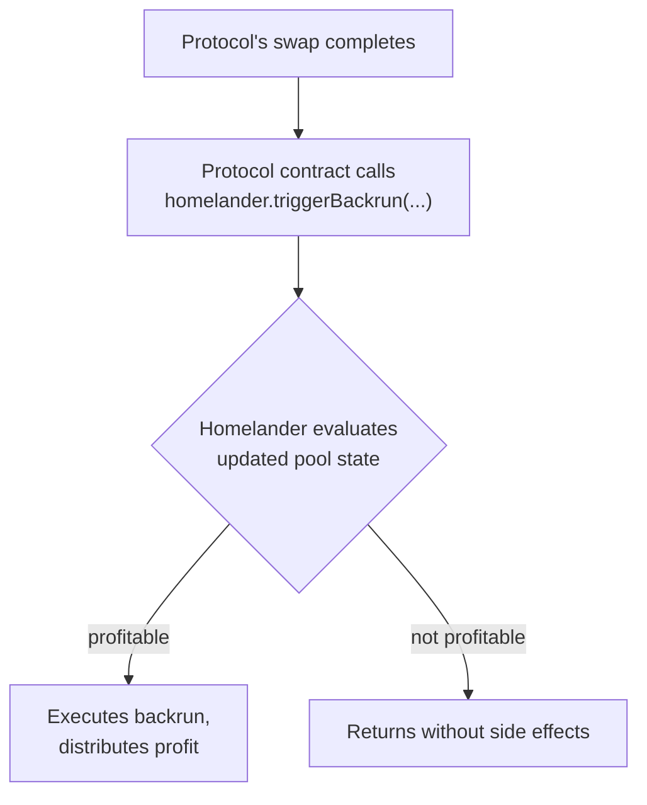

Direct integration lets any smart contract invoke the Homelander backrun trigger explicitly, after completing its own swap logic. This path suits protocols with custom architectures, aggregators, or any scenario that needs conditional or parameterized yield capture.

## How It Works

<div class="mermaid-small mermaid-small--direct-contract">



</div>

The call must be wrapped in error handling so that a failed or unprofitable backrun doesn't revert the outer transaction:

```
after swap completes:
  try:
    homelander.triggerBackrun(poolId, amountIn, direction, recipient, configId)
  catch:
    continue            // swap is unaffected
```

Omitting the try/catch means a failed backrun propagates and reverts the caller's own transaction — this is the one integration requirement that's non-negotiable.

## triggerBackrun Parameters

```
poolId      — identifier of the pool that completed the swap
amountIn    — swap input amount, used to size the backrun
direction   — swap direction (token0 → token1, or token1 → token0)
recipient   — address that receives the protocol's share of backrun profit
configId    — distribution configuration registered for your protocol
```

## Configuration

`configId` identifies the revenue distribution settings registered for your protocol at integration time — it determines how backrun profit is allocated between the exchange, its users, and MEV-X. A single config can apply across all your pools, or separate configs can be registered per pool if different ratios are needed.

Contact the MEV-X team to register a configuration before deployment.
