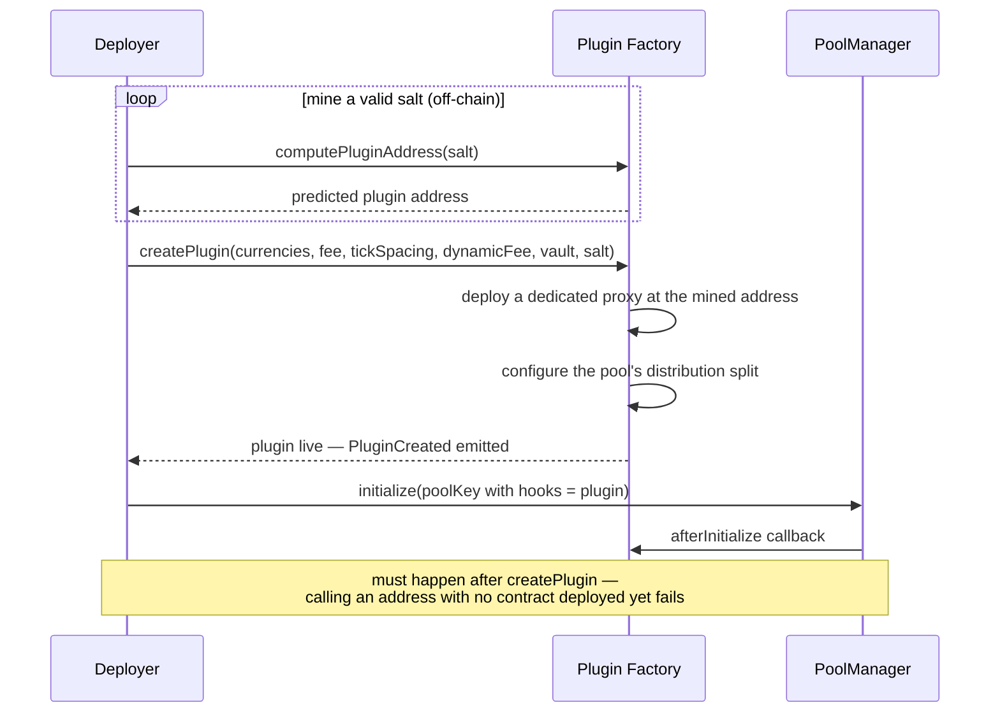

Deploying a pool with Homelander attached is a self-serve, permissionless process on Uniswap v4 — no coordination with any team, no approval step. In practice, most deployers won't construct these calls by hand; a wizard interface handles the sequencing for them. This page describes what happens underneath it.

## The Flow

Two details worth understanding, because they're easy to get wrong if you're constructing these transactions yourself:

**The plugin's address isn't arbitrary.** Uniswap v4 encodes which lifecycle callbacks a hook uses directly into its own address. Homelander's plugin needs a specific bit pattern set, so finding a usable address means trying candidates off-chain — `computePluginAddress` lets you check one without spending gas — until one matches, then deploying at exactly that address via `createPlugin`. This is standard Uniswap v4 hook-deployment practice, not something Homelander-specific, but it does mean plugin creation is mine-then-deploy, not a single guessable call.

**Plugin creation and pool initialization are two separate steps, in a fixed order.** `createPlugin` attaches Homelander to a pool identity and configures its distribution split — it doesn't create the Uniswap v4 pool itself. That's a separate call, to Uniswap's own `PoolManager.initialize`, using a pool key whose hook address points at the plugin. It has to come after `createPlugin`: pool initialization calls into the plugin as part of its own sequence, and there's nothing to call into until the plugin exists.

## After Deployment

Once both steps complete, the pool is live, and Homelander evaluates every swap through it for a backrun opportunity automatically — no further setup, nothing to maintain.

**The recipient wallet isn't permanent.** `updateVault` lets the same address that ran `createPlugin` for a given pool reassign where its share of captured value settles, at any point, without redeploying anything. It's scoped to whoever created that specific pool's plugin — nobody else can call it.

**Fee configuration is a per-pool choice, not a fixed default.** `createPlugin` takes the pool's base fee and Homelander's dynamic-fee override as independent parameters, set at creation time — dynamic fees aren't automatic, they're opted into per pool.

For how captured value is split once it's distributed, see [Integrations Overview](../integration-overview).
