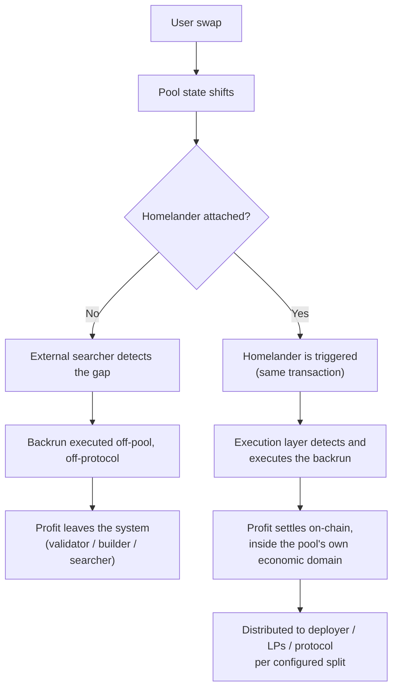
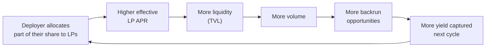

## Introduction

MEV-X Homelander is a yield maximization layer for AMM pools. Every user swap moves the pool's price and leaves it slightly out of step with the rest of the market — a price dislocation, and a short-lived arbitrage opportunity. Today, that opportunity is almost always captured outside the pool that created it, by external searchers, block builders, and validators; the pool itself earns nothing beyond its ordinary swap fee. Homelander closes that gap: a post-swap hook triggers an on-chain execution layer that detects and captures the opportunity inside the same transaction as the originating swap, before it can be broadcast, bundled, or extracted by anyone outside the system. The result is a deterministic on-chain revenue channel for the pool itself, distributed to the parties who created the opportunity — the pool's deployer, its liquidity providers, and the protocol — instead of leaking to infrastructure operators uninvolved in creating that liquidity or that trade.

## Economic Impact

### The zero-fee principle

A price dislocation has, at most, two claimants: whoever executes the arbitrage that closes it keeps a profit, and the pool keeps whatever fee it charges on that trade. Call the sum of the two the dislocation's **total combined revenue** — everything the inefficiency releases, no matter who ends up holding it. Our research, [*AMM Yield Maximization*](https://www.mev-x.com/papers/amm-yield-maximization/), shows that this total is largest when the fee on the arbitrage leg is zero: every basis point charged on top of it makes the arbitrage stop earlier, shrinking the total rather than growing the pool's share of it. At the fee that maximizes the pool's own fee revenue, over a quarter of the total is typically left unrealized — not transferred to anyone, just unclosed.

A pool can't normally offer that zero fee selectively. It has no reliable way to tell an arbitrage swap from an ordinary retail one, so it either charges everyone the same fee — leaving most of a small dislocation's value unrealized — or charges no one, giving away revenue on every ordinary trade. Homelander resolves this by merging the two roles that used to be adversaries: the pool becomes its own arbitrageur. A post-swap hook lets the pool execute its own rebalancing trade at a zero fee, atomically, inside the same transaction as the swap that created the gap. Retail traders keep paying the pool's normal fee — only the pool's own internal rebalancing leg trades at zero fee — which is how the rest of the total combined revenue is recovered without giving anything away to outside traders.

### Where the value goes

Captured backrun profit settles on-chain, atomically, inside the same transaction as the swap that created it. Self-serve pool deployments use a standard, protocol-wide distribution configuration; exchange and protocol integrations register a distribution configuration negotiated per partner. In both cases, the pool's deployer decides how their own portion is used — kept in full, or partially redirected to the pool's liquidity providers to raise its effective APR. How each path is configured is covered in [How Profit Is Distributed](./integration-overview#how-profit-is-distributed).

A deployer who redirects part of their share to LPs sets off a compounding loop rather than a one-off payout:

### How we measure it

Homelander's off-chain layer runs a reference MEV extractor alongside the production system — the same class of bot an external searcher would run against the same pool. Its output is never executed; it exists to compute capture-ratio: the share of the theoretically available backrun that Homelander's on-chain execution actually captures, relative to what an unconstrained external bot would have captured on the same opportunity. This turns effectiveness into a concrete, checkable number, benchmarked against a reference point on every pool.

The comparison isn't a one-off calculation. The reference extractor runs continuously against the same live pools as production, so its output reflects current market conditions, not a backtest. A separate off-chain routing layer continuously reprices candidate arbitrage paths and periodically pushes the resulting route parameters into the Router's on-chain configuration — so the routes Homelander draws from at swap time stay current with the market, not fixed at deployment.

Our team ran a large-scale study of this exact question — [*The Origins of MEV: Systematic Attribution of Arbitrage Opportunity Creation at Scale*](https://arxiv.org/abs/2604.27979v1) — and found that 96.7% of arbitrage opportunities are traceable to a single source transaction, the empirical basis for capturing that value atomically, at the point it's created.

## Who It's For

**Pool Deployers**
Teams launching a token, running market-making operations, or operating a launchpad-style project can deploy a new pool with the Homelander plugin already attached, through a self-serve interface — no separate integration step, no custom contract work. Every swap through that pool internalizes its own backrun automatically, and the deployer's share of captured value settles directly to their wallet with no separate claim step. → [For Pool Deployers](./for-pool-deployers)

**LP Providers**
Liquidity providers in a Homelander-enabled pool benefit automatically when the pool's deployer chooses to share part of their allocation — reflected directly in the pool's effective APR, with no separate action required from the LP. A dedicated LP-facing distribution flow is on the roadmap; today, participation is passive, through the pool the deployer has configured. → [For LP Providers](./for-lp-providers)

**DEX & Protocol Teams**
DEX protocols, aggregators, and custom AMM architectures can attach Homelander at the protocol level — through a native hook or plugin, a router-wrapping proxy, or a direct contract call — without modifying core pool logic. This is a partner-managed integration path, with a distribution configuration negotiated at onboarding. → [For DEXs & Protocols](./for-dexs-protocols)

**The Wider Ecosystem**
Every swap through a Homelander-enabled pool trades against liquidity that compounds rather than erodes — value that would otherwise leave the system for validators and block builders instead strengthens the same pool's depth and pricing over time. Aggregators and routers inherit that improved liquidity automatically, and infrastructure partners — plugin marketplaces, AMM framework maintainers — can offer it as a built-in feature of their own platform, without operating any arbitrage infrastructure themselves.

## Documentation Map

- **[Architecture](./architecture-overview)** — the on-chain contracts and off-chain modules that make up the system, how they interact, and where Homelander runs.
- **[Integrations](./integration-overview)** — how each type of client connects: self-serve pool deployment, LP participation, or protocol-level integration.
- **[Security](./security-overview)** — the guarantees that bound Homelander's execution, and the independent audits that have reviewed it.
