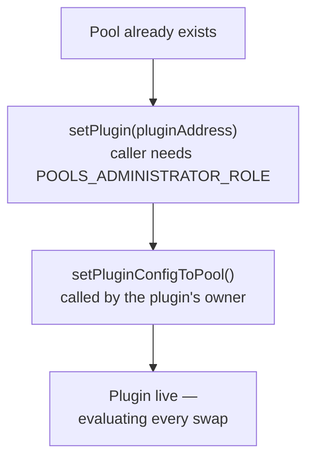

Plugin-based integration attaches Homelander through the AMM's own hook or plugin surface — no proxy, nothing wrapping the pool. Two frameworks support this today: Algebra Integral and PancakeSwap Infinity.

## Algebra Integral

Algebra Integral supports two distinct, officially supported ways to attach a plugin to a pool. Both end at the same place — a live plugin evaluating every swap — but they differ in who can do it and when.

**Manual attachment (`setPlugin`)** is the production path for existing pools, and how live partner integrations connect today.

<div class="mermaid-small mermaid-small--algebra">



</div>

Two separate calls, from two authorities that don't have to be the same address: whoever holds the administrator role on the pool's Algebra factory attaches the plugin, then the plugin's own owner activates it. The pool enforces the order itself — activation fails until attachment has already happened.

**Automatic attachment (Default Plugin Factory)** is the second mode Algebra Integral supports natively: a factory registered with an Algebra deployment can attach a plugin to every new pool at the moment it's created, without a separate `setPlugin` call. This is a real extension point in Algebra's own architecture, not a Homelander-specific workaround — where it's configured, attachment happens automatically alongside pool creation (activation is still a distinct step either way). This mode is part of Algebra's architecture; Homelander's own implementation of it is not yet part of the actively-maintained integration path documented on this site. Confirm production availability directly with the MEV-X team before relying on it.

## PancakeSwap Infinity

PancakeSwap Infinity attaches differently, and more simply. There's no address-mining requirement the way Uniswap v4 has, and no separate activation call at all — the plugin address goes directly into the pool's key, and initialization validates and activates it in one step:

```
PoolKey {
  currency0, currency1,
  hooks:       HOMELANDER_PLUGIN_ADDRESS,
  poolManager: CL_POOL_MANAGER,
  fee,
  parameters:  encodeCLParameters(tickSpacing, hookPermissions)
}
```

Calling `initialize` with this key deploys the pool and activates Homelander in the same transaction — there's nothing to do afterward.

## Monitoring

Both paths settle through the on-chain Profit Distributor. Whether a given settlement emits a distribution event, and its exact schema, depends on which distributor configuration your integration is registered against — get current specifics from the MEV-X team when you register your configuration, so your monitoring matches what your integration actually emits.
