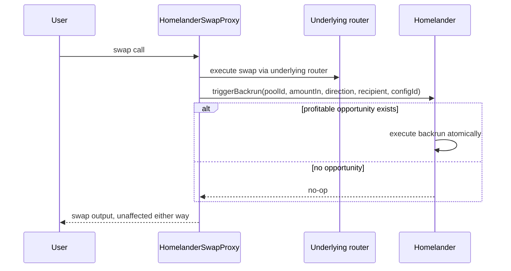

The Universal integration path captures arbitrage yield for DEX protocols that don't expose a native hook or plugin interface. A proxy contract wraps the existing router: the proxy executes the swap through the underlying DEX and triggers the Homelander backrun within the same transaction. No modifications to the underlying pool contracts are required.

## How It Works

<div class="mermaid-small mermaid-small--universal-dex">



</div>

If no profitable opportunity is found, the backrun step is skipped and the swap completes normally — the user's output is unaffected in either case.

## Integration Steps

Deploy `HomelanderSwapProxy` with the target router address — one proxy per router. Route swaps through the proxy instead of calling the router directly, passing `poolId` and `configId` alongside the standard swap parameters.

The proxy doesn't retain token balances between transactions; any leftover amounts are returned to the caller.

## Monitoring

```
event BackrunExecuted:
  poolId                (indexed)
  recipient             (indexed)
  profit
  profitToken
  configId              (indexed)
```

Filter by pool ID or config ID to track revenue from specific pools.
